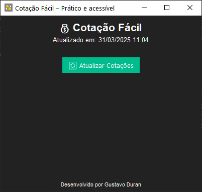

# Conversor_de_Moedas #

## Sobre o projeto

<h5 align="center">🚧 Versão do projeto - 1.0.5 🚀 em construção...🚧</h5>
Um sistema que realiza a conversão do Real BRL para o Dólar USD, Euro EUR, Libra GBP, Peso Argentino ARS, Iene Japonês JPY.
O sistema busca informações da conversão em tempo real utilizando o método GET e exibe o valor para o usuário.

O formulário é composto pelos seguintes campos:    
* Dólar (cotação em tempo real)
* Euro  (cotação em tempo real)
* Libra (cotação em tempo real)
* Peso Argentino (cotação em tempo real)
* Iene Japonês (cotação em tempo real)
  * Botão Converter
  * Bloco de texto para exibir os valores
